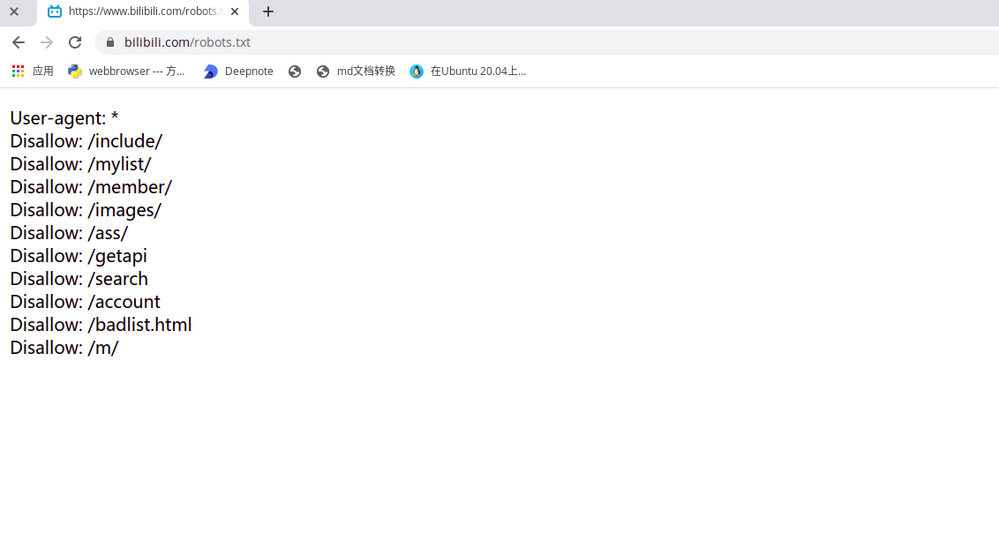

# 不用于任何商业用途，纯粹个人爱好，用于学习所用
# Creater :  redOrange
# Time: 2021.02.14
# Goal: 统计下到目前为止，说唱新时代上的歌曲播放量，顺便制作一张动态的的统计图

## 思路
* 首先查看B站rebots.txt
  

* 使用selenium 脚本 爬去各个歌曲的播放量

* 存储表设计
* * 歌名  作者  播放量   时间